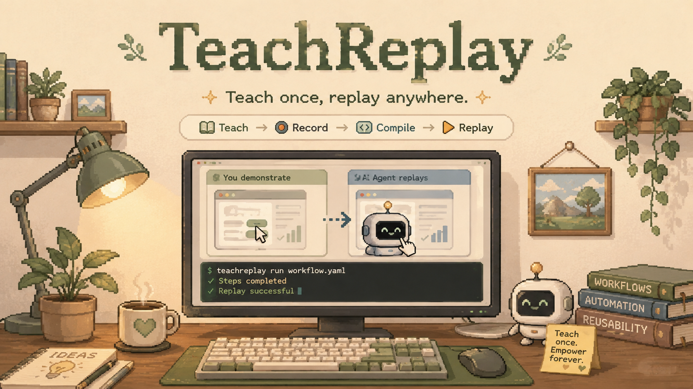

<p align="center">
  
</p>

<h1 align="center">TeachReplay</h1>

<p align="center"><strong>Teach once, replay anywhere.</strong></p>

<p align="center">🌐 <a href="https://ottohere-mourn.github.io/TeachReplay/">Project website</a></p>

<p align="center">
TeachReplay is a <strong>harness-agnostic Teach-by-Demonstration engine</strong>: show a workflow once —
clicks, typed values, shell commands — and it becomes a reusable, parameterized skill that can
be replayed later with different inputs and an explicit success/failure verdict on real computers.
</p>

<div align="center">

[](assets/teachreplay-demo.mp4)

*Teach → Compile → change parameters → Replay → Success · 26 s · [watch in HD](assets/teachreplay-demo.mp4)*

</div>

---

## What is TeachReplay?

```text
Teach → Record → Compile → Replay → Verify
```

1. **Teach** — start a recording and demonstrate the task once on a computer.
2. **Record** — the recorder watches the computer's *semantic* state (URLs, visible text,
   element roles and values) and diffs it into a versioned trajectory. Password fields stay
   masked; every value passes secret redaction.
3. **Compile** — a deterministic compiler turns the trajectory into a **parameterized skill**:
   your demonstrated values become inputs with your values as defaults. GUI steps are grounded
   semantically (role + name, never raw coordinates); shell commands become real CLI steps
   with their recorded exit codes.
4. **Replay** — the engine re-snapshots per step, matches targets semantically, acts, and
   verifies each step's effect. One bounded retry, an optional model-assisted recovery hook,
   then **explicit failure**.
5. **Verify** — success requires the recorded condition (URL or confirmation text) to hold.
   "The engine stopped" is never success.

## Package overview

| Package | Purpose |
| --- | --- |
| [`@teachreplay/core`](packages/core) | trajectory schema · recorder · parameterized skill compiler · parameter substitution · replay engine · verifier · file stores · `createTeachRuntime` orchestration |
| [`@teachreplay/remote`](packages/remote) | generic SSH Linux computer backend (Xvfb + Chrome DevTools) with GUI + shell channels — not provider-specific |
| [`@teachreplay/mock`](packages/mock) | deterministic in-memory demo computer for tests and local demos |
| [`@teachreplay/adapter-dsh`](packages/adapter-dsh) | DeepSeek Harness plugin registering `teach_*` tools |

## Architecture

The core owns all Teach-by-Demonstration logic and depends on **nothing but Node.js** — an
enforced invariant ([independence test](packages/core/test/independence.test.ts)). Adapters
contribute only backends, stores, and event sinks:

| Integration | Status |
| --- | --- |
| **Standalone** (`createTeachRuntime` + file stores + mock/remote backends) | ✅ included — see the [standalone demo](examples/standalone-demo) |
| **OpenMausBot** ([TeachReplay-OpenMausBot](https://github.com/Ottohere-Mourn/TeachReplay-OpenMausBot)) | ✅ thin adapter — the v0.1 integration rebuilt on the core |
| **DeepSeek Harness** ([deepseek-ai/deepseek-harness](https://github.com/deepseek-ai/deepseek-harness)) | ✅ verified — plugin builds, registers `teach_*` tools, and runs Teach → Compile → Replay through real DSH tool dispatch inside the official workspace |

## TeachReplay for DeepSeek Harness

`@teachreplay/adapter-dsh` adds teach-by-demonstration tools to
[DeepSeek Harness](https://github.com/deepseek-ai/deepseek-harness) agents:
`teach_start` / `teach_stop` / `teach_compile` / `teach_replay` /
`teach_shell` — the same Record → Compile → Replay → Verify engine, no core
logic duplicated.

- **Verified against a real DSH workspace** (`dsh-v0.1.1-rc.2`): the plugin
  builds, registers, and all five tools run through the real DSH tool
  runtime (`ctx.tools.execute`) — 3/3 integration tests
- **Installation**: DSH's sub-packages resolve only inside its workspace, so
  the supported path is the documented source/workspace installation — see
  the [adapter README](packages/adapter-dsh/README.md) (⚠️ DSH is in
  developer preview with compatibility-breaking changes; re-verify per
  release)
- **Demo**: [`examples/dsh-demo`](examples/dsh-demo) runs
  `teach_start → demonstrate → teach_stop → teach_compile → change
  parameters → teach_replay → success` locally

*(Not merged upstream — the adapter ships here in the TeachReplay monorepo.)*

## Quick start

```sh
git clone https://github.com/Ottohere-Mourn/TeachReplay.git
cd TeachReplay
pnpm install
pnpm build
pnpm demo        # standalone: record → compile → change parameters → replay → verify
pnpm test        # 50 tests, including the zero-harness-dependency invariant
pnpm typecheck
```

The demo runs entirely on the built-in demo computer — no credentials, no network, no harness.

## Real evaluation

`scripts/mini-benchmark.mjs` runs 8 tasks / 14 replays against a real remote Linux computer
(GUI + CLI, SSH env-configured). Every success is checked against ground truth on the machine,
not just the replay's own verdict. Latest real run (results in
[`scripts/teach-benchmark-results.json`](scripts/teach-benchmark-results.json)):

| Metric | Result |
| --- | --- |
| Verdicts correct | **14/14** |
| Normal replay success | **12/12** |
| Changed-parameter replays | **6/6** |
| GUI + CLI workflow | success, processed output matches |
| Severe UI drift / missing element | **detected as explicit failures (2/2)** |
| Ground-truth mismatches | **0** |

An honest small-scale sanity check — not a claim of state of the art.

## Limitations

- Recording observes **state transitions** (polled, ~500 ms), not input events — very fast
  actions can coalesce. Slow, deliberate demonstration is the intended input.
- Clicks are inferred from state changes; ambiguous transitions record no click rather than a
  wrong one.
- Model-assisted recovery is an optional hook (`ModelBackend`) — adapters wire the agent.
- Replay speed is SSH-round-trip bound (~4 s/step on the evaluation box).
- DSH is in developer preview with compatibility-breaking changes — re-verify per release.

## Attribution and license

Apache-2.0 (see [LICENSE](LICENSE)). TeachReplay was extracted from TeachReplay v0.1, developed
inside [OpenMausBot](https://github.com/milind-soni/OpenMausBot) (Apache-2.0) — see
[NOTICE](NOTICE) for the derived-work attributions, including the CDP helper derived from
OpenMausBot's computer-use tooling. Record-to-skill is not a new idea — TeachReplay's value is
the working, verified combination of demonstration → structured trajectory → parameterized
skill → executable replay → explicit verification across GUI + CLI.
